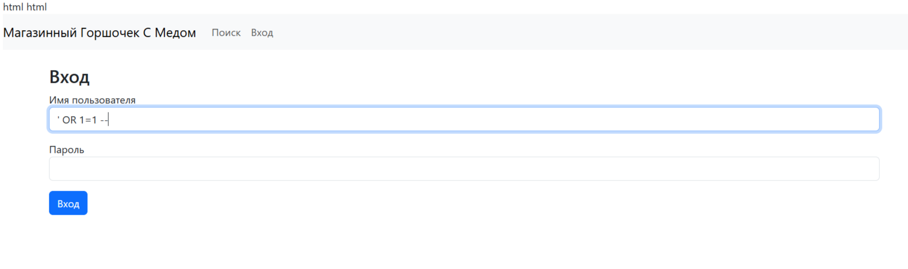
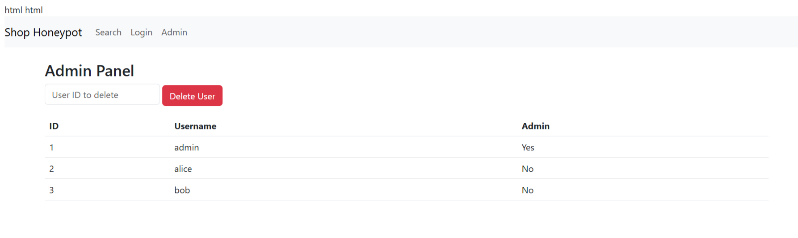
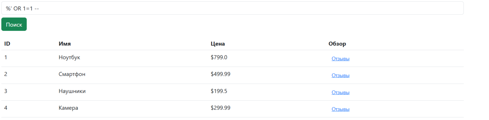
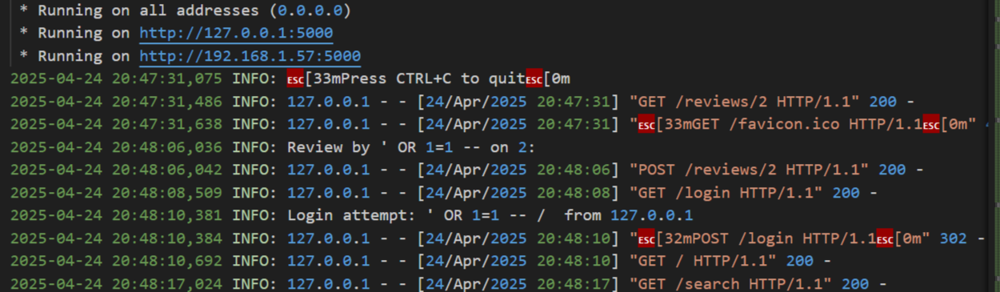

<table>
  <tr>
    <td>

<h1>🍯 Honeypot — ловушка для злоумышленников</h1>

**Honeypot** — это специально настроенная ловушка для киберпреступников.  
Она представляет собой программную или аппаратную систему, эмулирующую уязвимые сервисы или устройства, чтобы привлечь злоумышленников, зафиксировать их действия и проанализировать методы атаки.

В отличие от обычных защитных систем (брандмауэры, антивирусы и т.п.), honeypot не блокирует, а **пассивно наблюдает**.  
Это делает его ценным инструментом в арсенале кибербезопасности, особенно в целях разведки и обучения.

</td>
    <td align="center" style="width: 220px;">
      
    </td>
  </tr>
</table>

---

## 🎯 Цели Honeypot-систем

- **Раннее обнаружение вторжений**  
  Honeypot помогает поймать атаку до того, как она достигнет боевых систем.

- **Изучение инструментов и техник злоумышленников**  
  Команды, скрипты и действия злоумышленников фиксируются и могут быть проанализированы.

- **Выявление новых угроз и уязвимостей**  
  Honeypot может быть первым местом, где проявляется ранее неизвестная атака (zero-day).

- **Разработка правил обнаружения**  
  На основе поведения в honeypot можно создавать Snort/YARA-правила и обогащать базы IoC.

---

## 🧱 Как работает Honeypot?

- Эмулирует реальные сервисы: SSH, FTP, HTTP, базы данных и др.
- Работает в **изолированной среде** — например, в Docker или на отдельной виртуальной машине.
- Все действия записываются: команды, файлы, IP-адреса, используемые эксплойты.
- Интегрируется с SIEM для анализа и оповещений.
- Может взаимодействовать с системами геолокации и анализа IP (GeoIP, AbuseIPDB и др.).

## 🚨 Работа моего Honeypot

Я провёл проверку сайта на две основные уязвимости:
- **SQL-инъекцию**
- **XSS-атаку (межсайтовый скриптинг)**

---

## 🌐 Запускаем наш сайт

---

### 🐍 Проверка на SQL-инъекцию

Для того чтобы войти в аккаунт под админом, достаточно ввести в поле "Имя пользователя" следующую конструкцию:
' OR 1=1 --

Это позволяет обойти проверку логина и пароля:

---

### ✅ Получаем доступ администратора

После ввода инъекции — мы оказываемся в учётной записи администратора:

---

### 📦 Вывод всех товаров через SQL-инъекцию в поиске

Вводим в поисковую строку:

%' OR 1=1 --

Результат — отображаются **все товары в базе данных**:

---

## 📜 Логирование событий

Как я писал выше, Honeypot записывает все действия, которые происходят на сайте. Посмотрим журнал событий:

Мы видим, что каждый шаг (вход, поиск, просмотр) фиксируется в реестре событий — это позволяет отслеживать атаки и проводить анализ поведения злоумышленников.

